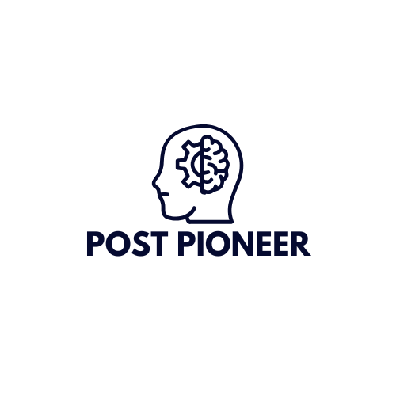

  

<h1 align="center">Post Pioneer</h1>

## COSC 4P02 Team Project

This is a group project for the COSC 4P02 Software Engineering class, taught by Professor Naser Ezzati-Jivan at Brock University.

View our project documents here: [Documents](./Documents)

## Project Description 📝

The project is a SaaS web app that enables users to create social media posts by leveraging AI to aggregate relevant content and generate summarized scripts, audio, and videos. The content is automatically posted to various social media applications through platform APIs, and the bots performance can be visualized within the app.

## Team Members 🌟

| Name                                              | Student Number |
| ------------------------------------------------- | -------------- |
| Will Yochim - Product Owner, Developer            | 7630924        |
| Mohammed Shihab Khateeb - Scrum Master, Developer | 6867691        |
| Nadine Hoda - Developer                           | 7597545        |
| Ritika Chaudhary - Developer                      | 7392459        |
| Karan Arora - Developer                           | 6226120        |
| Charmvir Grewal - Developer                       | 7026057        |

## License

This project is licensed under the GNU General Public License v3.0 - see [License](./LICENSE) for information.
